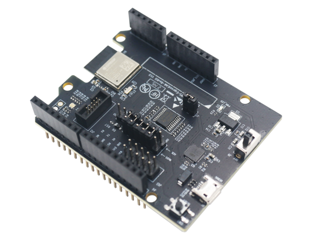
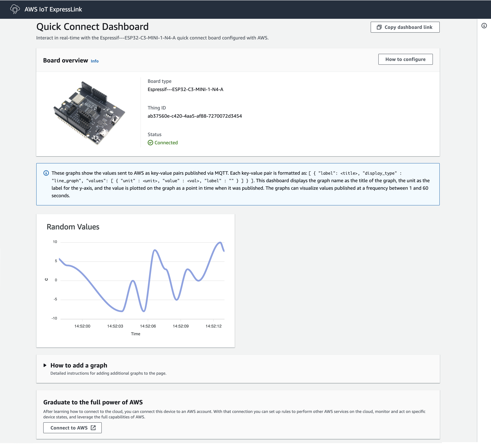

# Getting Started Guide for Espressif's AWS IoT ExpressLink Evaluation Kit

> **IMPORTANT**: ExpressLink firmware releases can only be flashed on ExpressLink modules and DevKits.

# Table of Contents

1. [Document Information](#1-document-information)
2. [Overview](#2-overview)
3. [Hardware Description](#3-hardware-description)
4. [Run the Quick Connect demo application](#4-run-the-quick-connect-demo-application)
5. [Setup your AWS account and Permissions for IoT development](#5-setup-your-aws-account-and-permissions-for-iot-development)
6. [Registering ExpressLink to your development account](#6-registering-expresslink-to-your-development-account)
7. [Connecting and Interacting with AWS cloud](#7-connecting-and-interacting-with-aws-cloud)
8. [Using ExpressLink with the Arduino Sketch](#8-using-expresslink-with-the-arduino-sketch)
9. [Upgrading ExpressLink firmware](#9-upgrading-expresslink-firmware)
10. [Troubleshooting](#10-troubleshooting)

# 1. Document Information

## 1.1 Revision History (Version, Date, Description of change)

1.0 29-November-2021 Final Draft  
1.1 20-June-2022 Revised GSG with extended CONFMODE, steps for Quick Connect demo and better OTA steps

# 2. Overview



Espressif's AWS IoT ExpressLink (Henceforth referred to as ExpressLink) module is a connectivity module that connects via a serial interface (UART) and uses an abstracted Application Programming Interface (API) to connect any host application to AWS IoT Core and its services.
In so doing, the ExpressLink module offloads complex and undifferentiated workload such as authentication, device management, connectivity, and messaging from the application (host) processor.
It enables a scalable migration for millions of embedded applications to cloud-connected applications and offers fast time to market.  
More information on AWS IoT ExpressLink can be found [here](https://aws.amazon.com/iot-expresslink/).  
The developer documentation can be found [here](https://docs.aws.amazon.com/iot-expresslink).  
Examples for AWS IoT ExpressLink can be found [here](https://github.com/aws/iot-expresslink).  

>  **NOTE**: Please upgrade your ExpressLink module to the latest available release as shown in [Section 9](#9-upgrading-expresslink-firmware) before proceeding with the Quick Connect demo application from [Section 4](#4-run-the-quick-connect-demo-application), or other examples mentioned in this guide.
>
> The OTW upgrade approach requires a smaller number of setup steps and is the preferred method for the first upgrade during evaluation.

# 3. Hardware Description

Espressif's AWS IoT ExpressLink board (ESP32-C3-AWS-ExpressLink-DevKit) (Henceforth referred to as ExpressLink board) has an Arduino shield form factor, so it can be plugged directly on top of the standard Arduino.
It can also be used with a Raspberry Pi or any other host.  
It has the following connection pins that need to be made, for full functionality of the board:  

| ExpressLink Pin | ESP32-C3 GPIO Pin | ESP32-C3-MINI-1-N4-A Module Pin |
|-----------------|-------------------|---------------------------------|
| TX              | IO19              | 27                              |
| RX              | IO18              | 26                              |
| EVENT           | IO10              | 16                              |
| WAKE            | IO3               | 6                               |
| RESET           | EN                | 8                               |

**NOTE**: While all the communication between the ExpressLink modules and the AWS cloud is encrypted during transmission (using TLS 1.2 protocol) and at rest, the serial interface (UART) between the host processor and the module is not encrypted. If sensitive data needs to be transmitted to and from the ExpressLink module, and an unauthorized person can be assumed to gain physical control of the device, we recommend the host processor and the corresponding cloud application to implement a suitable additional end-to-end message encryption scheme

## 3.1 DataSheet

Espressif's AWS IoT ExpressLink board is based on the ESP32-C3-MINI-1-N4-A.  
The Datasheet can be found [here](https://www.espressif.com/sites/default/files/documentation/esp32-c3-mini-1_datasheet_en.pdf).

## 3.2 Standard Kit Contents

- One unit of Espressif's AWS IoT ExpressLink board.

## 3.3 User Provided items

- Arduino or Raspberry Pi  
- Any development host

You may also need the following items:  
- MicroUSB cable such as [this](https://www.amazon.com/AmazonBasics-Male-Micro-Cable-Black/dp/B0711PVX6Z/).  
- Jumper cables such as [these](https://www.amazon.com/Elegoo-EL-CP-004-Multicolored-Breadboard-arduino/dp/B01EV70C78/).  
- USB TTL converter such as [this one](https://www.amazon.com/Adapter-Serial-Converter-Development-Projects/dp/B075N82CDL/).

## 3.4 3rd Party purchasable items

[Arduino purchase link](https://store-usa.arduino.cc/collections/boards/products/arduino-uno-rev3)  
[Raspberry Pi purchase link](https://www.raspberrypi.com/products/)  

## 3.5 Additional Hardware References

Refer to the [ESP32-C3 Hardware Reference](https://docs.espressif.com/projects/esp-idf/en/latest/esp32c3/hw-reference/esp32c3/user-guide-devkitm-1.html#hardware-reference), for more information on the hardware.

## 3.6 Set up your hardware

## 3.6.1 With Arduino

1. For using the ExpressLink board with an Arduino board that can be used with shields, there is no additional setup required.
2. You can directly plug the ExpressLink board onto the Arduino board's headers.
3. Once this is done, ensure that the ExpressLink board's switch is in OFF state.
4. You may now connect the Arduino to your computer, and that will automatically power the board.
5. You can use the Arduino sketch as shown in [Section 8](#8-using-expresslink-with-the-arduino-sketch) to quickly get started.  

The pins of the ExpressLink board are mapped to the Arduino as follows:  

| ExpressLink Pin | Arduino Pin |
|-----------------|-------------|
| RESET           | 4           |
| WAKE            | 3           |
| EVENT           | 2           |
| RX              | 1           |
| TX              | 0           |
| IOREF           | IOREF       |
| GND             | GND         |

## 3.6.2 With Raspberry Pi

1. To connect the ExpressLink board to the Raspberry Pi, you need to connect the TX, RX, EVENT, WAKE and RESET male pins of the J13 connector on the ExpressLink board to the following GPIO pins of the Raspberry Pi (using female-to-female jumpers):

| ExpressLink Pin | Raspberry Pi GPIO |
|-----------------|-------------------|
| RESET           | GPIO 4            |
| WAKE            | GPIO 27           |
| EVENT           | GPIO 22           |
| RX              | GPIO 15           |
| TX              | GPIO 14           |
| IOREF           | 3V3 Power         |
| GND             | GND               |

2. You can now access ExpressLink on your Raspberry Pi, by using a desktop terminal application of your choice and using /dev/ttyS0 with the settings as shown in the table in Section 3.7

## 3.6.3 With any development host

The ExpressLink board can be used with any development host, over a USB serial interface (using a USB-to-TTL converter) and using the simple AT commands for controlling ExpressLink.

| ExpressLink Pin | USB-to-TTL converter |
|-----------------|----------------------|
| RX              | RX                   |
| TX              | TX                   |
| GND             | GND                  |

> Please note that, in this case, additional functionality like WAKE and EVENT cannot be utilised, but this can serve as a simple way for a quick evaluation and understanding behaviour of commands.

## 3.7 Set up host machine

To establish a serial connection between your host machine and ExpressLink, open a desktop terminal application for your host machine (e.g., TeraTerm for Windows, CoolTerm for Mac) and select the port corresponding to the evaluation kit. Configure the desktop terminal application as follows:  

| Config Option | Value     |
| ------------- | --------- |
| Baudrate      | 115200    |
| Bits          | 8         |
| Parity        | None      |
| Stopbit       | 1         |
| Flow control  | None      |
| Local Echo    | Yes       |

For a quick check, in the terminal window type: **AT** followed by **return**. If you receive the answer **OK** , Congratulations! You have successfully connected the evaluation kit to your host machine.

> Please note that it is **NOT** possible to use the ExpressLink board using **ONLY** the connections shown in step 6a, i.e. it is **NOT** possible to give the AT commands using the console where you can see the ExpressLink bootup log. You will need to do additional steps as shown in 3.6.2 and 3.6.3 in case of Raspberry Pi and hosts other than Arduino. 

Keep the terminal open, as it is needed for subsequent steps.

# 4. Run the Quick Connect demo application
The Quick Connect demo application allows you to establish a connection with AWS IoT, all in the space of a few minutes; no dependencies to install, no source code to download and build, and no AWS account required. 

> **Note:** This demo is designed for ExpressLink boards running ExpressLink firmware v1.X.X and up.

To run the demo, follow the below steps:

1.	If you opened a terminal application in the previous step, be sure to disconnect that application from the serial port. 
2.	Download the Quick Connect executable:  
A.	[Download for Mac](https://quickconnectexpresslinkutility.s3.us-west-2.amazonaws.com/QuickConnect_v1.9_macos.x64.tar.gz)  
B.	[Download for Windows](https://quickconnectexpresslinkutility.s3.us-west-2.amazonaws.com/QuickConnect_v1.9_windows.x64.zip)  
C.	[Download for Linux](https://quickconnectexpresslinkutility.s3.us-west-2.amazonaws.com/QuickConnect_v1.9_linux.x64.tar.gz)  
3.	Unzip the package. You will see a config.txt file. Open this and enter the serial port corresponding to the evaluation kit (for example, `COM14`, `/dev/cu.usbserial-12345`, and so on) in the serial port field.  
4.	Enter your Wi-Fi credentials in the SSID and Passphrase fields.  
5.	Run the "Start_Quick_Connect" executable.  

The demo will connect to AWS IoT and give you a URL that you can use to visualize data flowing from the device to the cloud using **AT+SEND** commands. The demo will run for up to two minutes, and afterwards, you will be able to type **AT+SEND** commands yourself and see the data coming in on the visualizer. 




# 5. Setup your AWS account and Permissions for IoT development

Refer to the instructions at [Set up your AWS Account](https://docs.aws.amazon.com/iot/latest/developerguide/setting-up.html). Follow the steps outlined in these sections to create your account and a user and get started:

- Sign up for an AWS account and
- Create a user and grant permissions.
- Open the AWS IoT console

Pay special attention to the Notes.

# 6. Registering ExpressLink to your development account

To create an IoT _Thing_ and add it to your account we will need to retrieve the ExpressLink module Thing Name and its corresponding certificate.  
There are two methods to obtain the certificate, as shown in steps 6a and 6b:  

## 6a. Directly connecting the ExpressLink board to your computer

1. Remove any other connections you have made to the ExpressLink board.
2. Connect the ExpressLink board to the computer, using the microUSB port on the board, and a microUSB to USB cable.
3. Open the desktop terminal application on the host machine, and select the UART port of the board, and set baud rate to 115200.
4. Press the Reset button on the board, and ensure that you can see the bootup log.
5. The bootup log will clearly display the device certificate and the Thing Name towards the end.
6. Make a note of the Thing Name and copy the certificate from the `-----BEGIN CERTIFICATE-----` line till the `-----END CERTIFICATE-----` line and save it to a file named `ThingName.cert.pem`

## 6b. Using AT Commands to obtain Certificate and Thing Name

1. In the desktop terminal application type the command: **AT+CONF? ThingName**
2. Make a note of the returned string (a sequence of alphanumeric characters) from the terminal.
3. In the desktop terminal application type the command: **AT+CONF? Certificate pem**
4. Copy the returned string (a longer sequence of alphanumeric symbols), save into a text file on your host machine as "ThingName.cert.pem".

## 6c. Setting up on the AWS IoT Console

1. Open the [AWS IoT Console](http://console.aws.amazon.com/iot). Select **Manage** then select **Things**. Choose **Create things** , select **Create single thing** , click **Next**.  
2. On the **Specify thing properties** page, paste the previously copied ThingName (from step 6a or 6b) from terminal into the **Thing name** under **Thing properties** on the console. Leave other fields as default, then click **Next**.
3. On the **Configure device certificate page** , select **Use my certificate** , choose **CA is not registered with AWS IoT.**
4. Under **Certificate** , select **Choose file**. Double click on "ThingName.cert.pem" file obtained in step 6a or 6b.
5. Under **Certificate Status** , select **Active**
6. Click **Next** to **Attach policies to certificate**.
7. Under **Secure** , select **Policies.**
8. Click **Create** to **Create a policy**. Put policy name (e.g. IoTDevPolicy) and click **Advanced mode**.
9. Copy the below section into the console.

`
{ "Version": "2012-10-17", "Statement": [{ "Effect": "Allow", "Action": "*", "Resource": "*" }] }
`

_NOTE – The examples in this document are intended only for dev environments. All devices in your fleet must have credentials with privileges that authorize only intended actions on specific resources. The specific permission policies can vary for your use case. Identify the permission policies that best meet your business and security requirements. For more information, refer to Example policies and Security Best practices._

Click **Save** to complete the Thing creation.

1. In the AWS IoT Console, choose **Settings** , copy your account _Endpoint_ string under _Device data endpoint._
2. In the desktop terminal application type the command: **AT+CONF Endpoint=<_replace-with-your-endpoint-string_>**

## 6.1 Set up for Wi-Fi

The ExpressLink board requires access to a local Wi-Fi router in order to connect to the Internet. You can enter the required security credentials in two ways, as shown in steps 6.1.1 and 6.1.2  

**Note** : When the Wi-Fi on the ExpressLink board is not configured, the board will try to connect to the following SSID: **ESP-ExpressLink-Demo** and Passphrase: **ExpressLink@12345** by default.  

## 6.1.1 Using CONFMODE  

1. The ExpressLink board can be easily configured with a mobile device, using Espressif's open source provisioning apps, available on the Google Play Store for Android, and the Apple App Store for iOS and iPadOS.  

[Google Play Store link](https://play.google.com/store/apps/details?id=com.espressif.provble)  
[Apple App Store link](https://apps.apple.com/app/esp-ble-provisioning/id1473590141)

Both the apps are open source, and the source code for the apps is available on GitHub.  

[Android Provisioning App on GitHub](https://github.com/espressif/esp-idf-provisioning-android)  
[iOS/iPadOS Provisioning App on GitHub](https://github.com/espressif/esp-idf-provisioning-ios)

2. In the desktop terminal application, type the command: **AT+CONFMODE**  
    You will receive an "OK CONFMODE ENABLED" on the host.  

  > **Note:** By default, the BLE device name is PROV_XXXXXX  
  > where XXXXXX are the last 3 bytes of the MAC address of your ExpressLink in hex format and no Proof-of-Possession (PoP).
  >
  > It is also possible to specify a BLE Device Name and the Proof-of-Possession (PoP) value by using the command  
  > **AT+CONFMODE <_device-name_>, <_PoP-value_>**
  >
  > The <_device-name_> can be 29 characters long, anything longer would be truncated. It cannot contain a comma.  
  > The <_PoP-value_> length is limited by the maximum AT command length (5000 characters) and leading spaces are ignored.
  >
  > Additional technical information about the provisioning process can be found [here](https://docs.espressif.com/projects/esp-idf/en/latest/esp32c3/api-reference/provisioning/provisioning.html).
  >
  > Few examples of using <u>CONFMODE</u>:
  >
  > | ExpressLink AT Command         | BLE Device Name | PoP Value |
  > | ------------------------------ | --------------- | --------- |
  > | AT+CONFMODE                    | PROV_XXXXXX     | -         |
  > | AT+CONFMODE MyDevice, abcd1234 | MyDevice        | abcd1234  |
  > | AT+CONFMODE ,abcd1234          | PROV_XXXXXX     | abcd1234  |
  > | AT+CONFMODE MyDevice           | MyDevice        | -         |

3. Now, open the Espressif provisioning app on your mobile device that you have installed in the previous step, and click on the "Provision Device" button.

4. Then click on "I don't have a QR code".

5. The app will now search for active BLE devices.

6. When you see your device, click on its name.

   > If you have specified a PoP, you will need to enter it after selecting the device.

7. You will now see a list of the 2.4 Ghz Wi-Fi networks that the ExpressLink board can see.  
    Select the Wi-Fi network that you would like to connect to, and enter the credentials.

8. The credentials will be sent and saved to the device.

## 6.1.2 Using AT Commands  

1. In the desktop terminal application type the command: **AT+CONF SSID=<_replace-with-your-router-ssid_>**
2. In the desktop terminal application type the command: **AT+CONF Passphrase=<_replace-with-your-router-passphrase_>**

**Note** : Your local router's SSID and passphrase are stored securely inside the ExpressLink module. While the SSID can be retrieved later (i.e., for debugging purposes) any attempt to retrieve the Passphrase will return an error.

## 6.2 Completion

Congratulations! You have completed the registration of the evaluation kit as a Thing in your IoT account. You will not need to repeat these steps the next time you connect, as the ExpressLink module will remember its configuration and will be ready to connect to your AWS account automatically.

# 7. Connecting and Interacting with AWS cloud

We will use the MQTT client in the AWS IoT console to help us monitor the communication between your evaluation kit and the AWS Cloud.

1. Navigate to the AWS IoT console ([https://console.aws.amazon.com/iot/](https://console.aws.amazon.com/iot/)).
2. To open the MQTT client, in the navigation pane, choose **Test** and then **MQTT Test Client.**
3. In _Subscribe to a topic_, enter #, and then click **Subscribe**.

## 7.1 Connecting

Establish a secure connection by entering the command: **AT+CONNECT**

After a short time, you will receive the message **OK 1 CONNECTED**

Congratulations! You have successfully connected to your AWS cloud account.

## 7.2 Sending data to the AWS cloud

To send “Hello World!” message, first enter the command **AT+CONF Topic1=data**

You will receive the response from the module: **OK**

Next, enter the command: **AT+SEND1 Hello World!**

After a short time, you will receive the message **OK**

You should see the "Hello World!" message appear on the AWS IoT console under the topic "data".

## 7.3 Receiving data and commands from the cloud

To receive messages, first enter the command: **AT+CONF Topic1=MyTopic**

You will receive the response from the module: **OK**

Next, enter the command: **AT+SUBSCRIBE1**

From the AWS IoT console, MQTT client, select **Publish to a topic** , type **MyTopic** in **Topic name** field, keep **"Hello from the AWS IoT console"** message then click "Publish".

On your terminal, enter the command: **AT+GET1**

You will receive the message **OK Hello from the AWS IoT console**

# 8. Using ExpressLink with the Arduino Sketch

We have provided a basic sketch in this repository [sketches/arduino_sample_sketch.ino](sketches/arduino_sample_sketch.ino) to get started quickly, with an Arduino.  
The sketch will do the following:  
- It will reset the board and wait till it is ready.
- It will check if the board is already provisioned (i.e. if it has credentials to connect to a Wi-Fi network already) and it will set the hardcoded Endpoint.
- If it does not have the credentials, it will enter CONFMODE (Refer Section 6.1.1 for steps to use this).
- Once it has been provisioned, it will try to connect to the Wi-Fi network.
- Once the connection has been successfully established, it will send "Hello World" to the "TEST" topic, every 10 seconds.  

Before you flash the provided sketch, change the hardcoded value of the Endpoint in the script the AWS IoT Endpoint that you obtained in Step 6c.

You can flash the sketch onto the Arduino board, using the steps shown [here](https://www.arduino.cc/en/main/howto).

> Note that the sketch is just a starting point, and is not the only way to use the ExpressLink board with an Arduino.  

## 8.1 Debugging the Arduino sketch

Arduino's standard RX and TX pins are used to communicate with the ExpressLink board.  
Hence, standard USB interface of Arduino cannot be used for logging and debugging.  
You can use any other UART of Arduino for debugging purpose, as described below:  

1. In order to debug your Arduino sketch, you will need to use a USB-to-TTL converter (purchase link can be found in section 3.3)
2. For logging anything from the sketch, you will need to connect pins of the Arduino (via the ExpressLink board) to the USB-to-TTL converter as shown in the table below:  

| ExpressLink Pin | USB-to-TTL converter Pin | Arduino Pin |
|-----------------|--------------------------|-------------|
| RX              | RX                       | 8           |
| TX              | TX                       | 9           |
| GND             | GND                      | GND         |

3. Use a desktop terminal application set at baudrate 115200 and the port of the USB-to-TTL converter to view the output.
The code snippet below shows how to accomplish this in an Arduino sketch.

```cpp
#include <SoftwareSerial.h>

SoftwareSerial mySerial(8, 9); // RX, TX

void setup()
{
    mySerial.begin(115200);
    while (!mySerial) {
        ;
    }
}

void loop()
{
    mySerial.print("Hello World!");
    delay(2000);
}
```

# 9. Upgrading ExpressLink firmware

In order to upgrade the ExpressLink board to the latest available firmware, you can follow any one of the approaches shown in Section 9.1 and 9.2

## 9.1 Carrying out an Over-The-Air (OTA) Upgrade

## 9.1.1 Prerequisites

1. Download the latest release for ExpressLink from the [releases section](https://github.com/espressif/esp-aws-expresslink-eval/releases).

2. Follow the general OTA update prerequisites mentioned [here](https://docs.aws.amazon.com/freertos/latest/userguide/ota-prereqs.html) and [Prerequisites for OTA updates using MQTT](https://docs.aws.amazon.com/freertos/latest/userguide/ota-mqtt-freertos.html).

## 9.1.2 Creating a Firmware Update job in AWS IoT

- Open [AWS IoT Console](http://console.aws.amazon.com/iot). Select **Manage** then select **Jobs**. Choose **Create job** , select **Create FreeRTOS OTA Update Job** , click **Next**.
- Provide a job name which is unique within your AWS account. Provide an optional description. Click **Next**.
- From **Devices to update** dropdown choose the thing name with which the ExpressLink is registered with the account. Select **MQTT** as the protocol to transfer, and unselect **HTTP** if selected.
- Choose **Sign a new file for me** which will display an option to 'Create new profile'.
  Follow the steps [here](https://docs.aws.amazon.com/freertos/latest/userguide/ota-code-sign-cert-esp.html) to create your own code signing profile.
  Ensure that you keep the `ecdsasigner.crt` file handy, it will be needed in subsequent steps.
- Select **Upload a new file** , click on **Choose file** and upload the firmware binary. Choose the S3 bucket in your account that you had created in the prerequisite steps, by selecting **Browse S3** option.
- Under **Path Name of file on device** you can enter **NA**.
  - Under **File type** drop down set value to `101` to signify it's an ExpressLink firmware update as opposed to a host firmware update.

- Choose the OTA update role created above from **role** dropdown under **IAM role** section. Click **Next**.
- Click **Create Job**. On successful creation it should list the job name and state as in progress.

## 9.1.3 Monitoring and Applying new firmware update for ExpressLink

You need to add the signature obtained previously, to the ExpressLink board so that the firmware can be verified.  
Start by giving the command:  
**AT+CONF OTACertificate=PEM**  
The module will respond with "OK" and go into "Certificate writing" mode.  
You can then paste the contents of the ecdsasigner.crt file in your terminal.  
You should see "OK COMPLETE" at the end.  

- ExpressLink module polls for firmware update jobs, receives and validates a job, and enters a state waiting for update to be accepted.
- Host application receives an OTA event indicating a new firmware image is available for ExpressLink.
- Host application can query the state of the job using the command **AT+OTA?**  
  You should see the module response **OK 1 version** to inform a module OTA firmware update was proposed.
- Host application can accept a new firmware update for by issuing command **AT+OTA ACCEPT**
- ExpressLink should now start downloading the firmware update from cloud. Host can monitor the state of the job using **AT+OTA?**
- On download completion and successful image signature validation, host receives an event to apply the new image.
- Host application can apply the new image by issuing the command **AT+OTA APPLY**
- ExpressLink now reboots and boots up with the new image. Host receives a **STARTUP** event indicating the new image is booted.
- Host application can connect back to the AWS IoT by issuing **AT+CONNECT**
- ExpressLink should now connect to AWS IoT, complete the self-test and mark the image as valid preventing any further rollback to old image.
- Going back to the AWS IoT console, job status should be marked as completed and succeeded.

**Note**: You need to run **AT+CONNECT** after the OTA update has been applied in order to complete the OTA. Failure to do so during the first bootup of the new firmware, will result in a rollback to the previous firmware.

## 9.2 Carrying out an Over-The-Wire (OTW) Upgrade

To facilitate situations in which OTA upgrades are difficult to setup or completely not possible due to poor connectivity, we have provided the facility to carry out OTW upgrades.  

First, download the latest release for ExpressLink from the [releases section](https://github.com/espressif/esp-aws-expresslink-eval/releases).  
The file `otw.py` needed for carrying out the OTW upgrade is [available](tools/otw.py) in this repository in the `tools` directory.  

1. Start by connecting the board to your computer, as shown in Section 3.6.3
2. Ensure that you have a functional Python 3.X installation.
3. Install PySerial by typing `pip3 install pyserial==3.5`
4. You can start the OTW process by typing `python3 otw.py (UART serial port) (Firmware binary filename)`
5. You should see percentage completion on the python console
6. The update can take around 2 minutes to complete, and you will see `Uploaded 100.0% Done...` on the console once it is complete.
7. Reset the board now, to boot into the latest firmware.

# 10. Troubleshooting

1. If you are not able to establish connection over the UART using microUSB port on the ExpressLink board in step 6a, you will need to download the drivers for it and check the additional information for your operating system in the [Establish Serial Connection](https://docs.espressif.com/projects/esp-idf/en/latest/esp32c3/get-started/establish-serial-connection.html) guide.

2. For common AT command issues, please refer to AWS IoT ExpressLink FAQ page.
